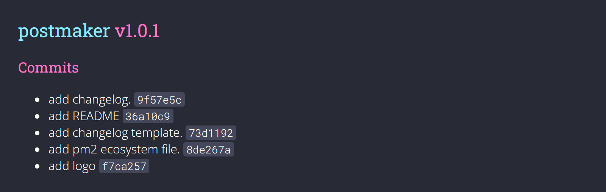

<div align="center">


<h5> A post maker bot written in JavaScript and Node.js.</h5>


</div>

## Latest Changes

<div align="center">
   
   </div>

## Dependencies
- [node.js](https://nodejs.org/en/download/) >= v14.16.0
- [npm]() >= v7.15.1


## Installation

clone the project:
```
git clone https://github.com/eyalmichon/postMaker.git
```
then inside the project folder use the following command to install required packages:
```
npm install
```


## Running & Usage

```
npm start
```
Now you'll need to get your API key from [here](https://telegram.me/BotFather#:~:text=BotFather%20is%20the%20one%20bot,BotFather%20right%20away.) by creating a bot.
Place the key inside `handler/secret.json`.

wow, you're done!